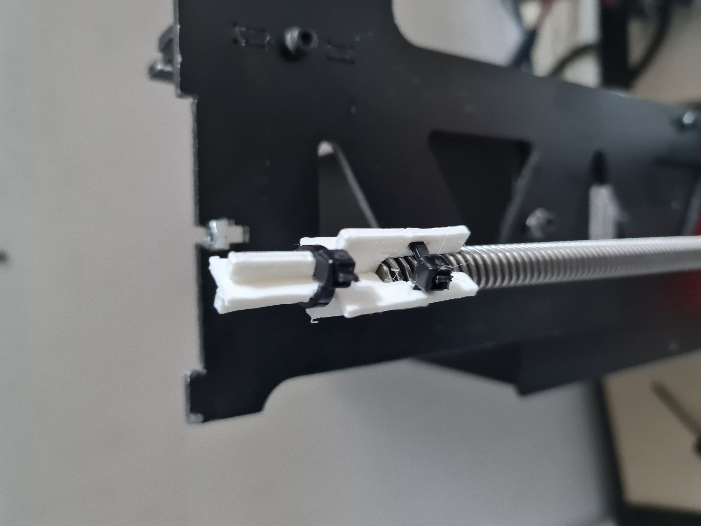

# Flat Z Stabilizer

This is an attempt to stabilize a wobbly Z axis in a printer that is missing Z rails, so it cannot print tall objects.

The two flat pieces form a piece that dhould be put at the end of the Z screw and fixed by zip-ties.

This is supposed to be a temporary fix!

